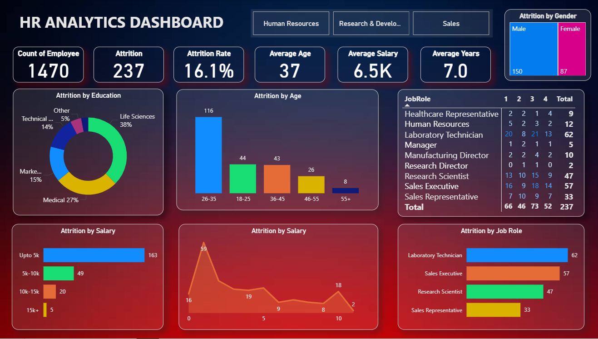

# 💼 HR Analytics Dashboard

A comprehensive HR analytics dashboard built using Power BI to visualize and analyze employee attrition trends based on multiple HR attributes like age, education, salary, and job role.

---

## 📊 Dashboard Highlights

- **Total Employees:** 1470  
- **Attrition Rate:** 16.1%  
- **Average Age:** 37  
- **Average Salary:** 6.5K  
- **Average Tenure:** 7 years

### Key Visual Insights:
- **Attrition by Education** – Most attrition in Life Sciences and Medical fields
- **Attrition by Age** – High attrition in the 26–35 age group
- **Attrition by Salary** – Majority attrition for employees earning under 5K
- **Attrition by Job Role** – Highest attrition among Laboratory Technicians and Sales Executives
- **Attrition by Gender** – More male attrition compared to female

---

## 🛠️ Tools & Technologies

- **Power BI Desktop**
- **Excel** – For initial data cleaning

---

## 📁 Dataset Details

- **File Name:** `employee_data.csv`
- **Attributes Include:**
  - Employee ID
  - Age, Gender, Education Field
  - Monthly Income
  - Job Role
  - Years at Company
  - Attrition Status (Yes/No)

---

## 📷 Dashboard Screenshot



---

## 📌 How to Use

1. Clone this repository:
   ```bash
   git clone https://github.com/yourusername/hr-analytics-dashboard.git```
2. Open HR_Analytics_Dashboard.pbix in Power BI Desktop.

3. Ensure the dataset is placed under the /data folder.

4  Refresh the data in Power BI to visualize and explore insights.

---

## 🤝 Acknowledgment
Guided by insights and tutorials from the Power BI community and open datasets.

---

## 📬 Contact

For any feedback or collaboration opportunities, feel free to connect:

- **LinkedIn:** [Profile Link](https://www.linkedin.com/in/rohit-lakha/)


